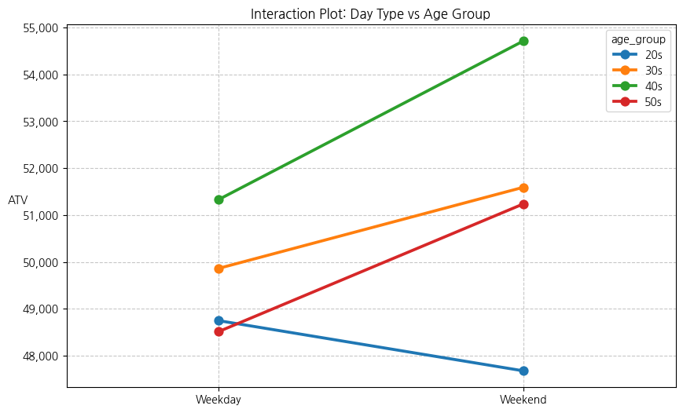

# 첫번째 가설
1. 다음 날이 주말에 가까울 수록 사람들의 소비성향이 커진다.
 - -> 다음 날이 노동에서 해방될 날과 가까울수록 소비성향이 커진다. (보상심리)
 - 익일노동압박을 고려하여 일요일의 매출감소성향은 우연이 아니다.
 - 
 
# 적용 기법
 - 가변수 회귀분석(Dummy Variable Regression)
 - 선형적 가중치 부여 모델
 - ANOVA

# Dummy Variable Regression                      
==============================================================================
Dep. Variable:                    ATV   R-squared:                       0.006
Model:                            OLS   Adj. R-squared:                  0.005
Method:                 Least Squares   F-statistic:                     31.32
Date:                Wed, 18 Feb 2026   Prob (F-statistic):           2.65e-55
Time:                        09:37:18   Log-Likelihood:            -6.2590e+05
No. Observations:               50924   AIC:                         1.252e+06
Df Residuals:                   50914   BIC:                         1.252e+06
Df Model:                           9                                         
Covariance Type:            nonrobust                                         
=================================================================================================================
                                                    coef    std err          t      P>|t|      [0.025      0.975]
-----------------------------------------------------------------------------------------------------------------
Intercept                                      4.104e+04    794.691     51.646      0.000    3.95e+04    4.26e+04
C(is_eve_of_weekend)[T.1]                      1807.7690    904.594      1.998      0.046      34.756    3580.782
C(age_group)[T.30s]                            1217.2361    709.628      1.715      0.086    -173.642    2608.115
C(age_group)[T.40s]                           -1756.4440    753.480     -2.331      0.020   -3233.273    -279.615
C(age_group)[T.50s]                           -2183.7997    955.976     -2.284      0.022   -4057.523    -310.077
C(sex)[T.M]                                    1612.9555    486.759      3.314      0.001     658.902    2567.009
C(is_eve_of_weekend)[T.1]:C(age_group)[T.30s]  1629.2509   1275.845      1.277      0.202    -871.419    4129.921
C(is_eve_of_weekend)[T.1]:C(age_group)[T.40s]   986.1094   1342.888      0.734      0.463   -1645.966    3618.185
C(is_eve_of_weekend)[T.1]:C(age_group)[T.50s]  2638.3251   1717.493      1.536      0.125    -727.980    6004.630
hour                                           1202.5892     83.464     14.408      0.000    1038.998    1366.180
==============================================================================
Omnibus:                   100944.522   Durbin-Watson:                   1.855
Prob(Omnibus):                  0.000   Jarque-Bera (JB):        655463155.998
Skew:                          15.699   Prob(JB):                         0.00
Kurtosis:                     557.912   Cond. No.                         70.1
==============================================================================

 - [ ]$H_0$: 주말 전야 여부(is_eve_of_weekend) 및 각 인구통계학적 특성(연령, 성별)은 건당 결제 금액($ATV$)에 영향을 미치지 않는다

 - [ x ]$H_1$: 적어도 하나의 가변수(특히 주말 전야 변수)는 건당 결제 금액($ATV$)에 유의미한 영향을 미친다. (즉, 주말 전야의 보상 소비 효과가 존재한다.)

is_eve_of_weekend의 p-value가 0.046으로 유의확률 0.05보다 작으므로 귀무가설을 기각한다.(대립가설 $H_1$을 채택한다.)

# 선형적 가중치 부여 모델

월요일부터 일요일까지 다음의 가중치를 부여함
[-1,-1,-1,-1,2.5,2.5,-1]

Test for Constraints                             
==============================================================================
                 coef    std err          t      P>|t|      [0.025      0.975]
------------------------------------------------------------------------------
c0          1.123e+04   2179.136      5.151      0.000    6954.591    1.55e+04
==============================================================================

$H_0$ : 대비 벡터(Contrast Vector)로 설정된 그룹 간(평일·일요일 vs 금·토요일) 평균 건당 결제 금액의 선형 결합은 0이다. (즉, 두 그룹 간에 소비 차이가 없다.)
$H_1$: 대비 벡터로 설정된 그룹 간 평균 건당 결제 금액의 선형 결합은 0이 아니다. (즉, 금·토요일의 소비가 평일 및 일요일에 비해 통계적으로 유의미하게 높다.)

p-value가 0.0 이므로 유의확률 0.05보다 작으므로 귀무가설을 기각한다.(대립가설 $H_1$을 채택한다.)

# ANOVA
-> 연령대의 집단을 포함하여 보상심리 비율을 확인하고자 함(20,30,40,50,60)

                            sum_sq       df          F        PR(>F)
C(week)               3.995384e+10      1.0  18.777050  1.471727e-05
C(age_group)          1.248863e+11      3.0  19.564219  1.134401e-12
C(week):C(age_group)  3.322968e+10      3.0   5.205635  1.359887e-03
Residual              1.227380e+14  57683.0        NaN           NaN

week -> p-value : 1.471727e-05 이므로 유의확률 0.05보다 작다.
age_group -> p-value : 1.134401e-12 이므로 유의확률 0.05보다 작다.
week:age_group -> p-value : 1.359887e-03 보상소비패턴이 연령별로 다르다.

- 

## '누가 보상심리가 더 강한가?'
- 

그래프 확인 결과 40대(5)와 50대(6)이 가장 가파른 기울기를 보임.
- 기울기 확인결과 40대가 1.08, 50대가 1.075수준으로 비슷한 기울기를 보였음(보상심리 정도)
즉, 보상심리 정도가 뛰어난 것은 40대, 50대임.

## 언제 ?

