**Dec.2025**
---
### 그래프 컬럼 설명
**ta_ymd :** 기준 년월일(YYYYMMDD) / **cty_rgn_no :** 시·군·구 코드

**admi_cty_no :** 행정동 코드(행정안전부 기준) / c**ard_tpbuz_cd :** 카드사 업종 분류 코드

**card_tpbuz_nm_1 :** 업종 대분류명 / **card_tpbuz_nm_2 : **업종 중분류명

**sex :** 성별(M/F) / **age :** 연령대 코드(01: 0–9세, 02: 10–19세, …, 11: 100세 이상)

**hour :** 시간대 코드(01: 00–06시, 02: 07–08시, 03: 09–10시, …, 10: 23시)

**day :** 요일 코드(01: 월, 02: 화, 03: 수, 04: 목, 05: 금, 06: 토, 07: 일)

**amt :** 매출 금액 / **cnt : 매출 건수**

""" 양식
# 📅 개발 및 학습 일지 (Development Log)
## 29.Dec.2025 [DAY-22]
## ✅ 한 일
## 배운점(TIL)
### TIL (간단한 Keyword 정리)
## 트러블슈팅 (Troubleshooting)

### 1. 파일중복
 - **문제 :** 
 - **원인 :** 
 - **방법 :** 
 - **결과 :** 


## 추가 공부

# dataclass 학습
# 클린코드

"""
# 📅 개발 및 학습 일지 (Development Log)
## 29.Dec.2025 [DAY-22]
## ✅ 한 일
 - [x] 분석지표 설정
 - [x] 타겟마케팅 수립
 - [x] T-test 검정

## 배운점(TIL)
 - '고기요리' 값을 심층분석하기로 결정함.
     - 시간대별 속성 라벨링

     - 평일 11~13시
         - 직장인 점심(프리미엄보단 가성비), 배를 채우기 위한 식사.

     - 평일 19~21시
         - 사회적 비용 (회식)
         - 친구끼리와 식사도 가능하지만 주말 점심,저녁은 A와 B랑은 또 다른 성격
         - 참고정도는 해야 함.
    
     - 주말
         - 가족 외식, 데이트 등 ```내 돈 내고 먹는 진짜 만족도.```

 - 현재까지 발굴한 정보
      - 우리가 아는 정보는 이천시의 '4050'은 큰 손이라는 것.
      - 20대는 점심보다 저녁에 마케팅자원을 투자해야 한다는 것

 - 검증 주제
     - 4050이 큰손인 이유는 돈이 많은 것인지, 만족도를 위한 것인지 소비 동기를 찾는 것.
     - 왜 연령별로 지갑을 여는지를 확인하고, 이를 활용한 타겟마케팅분석

 - 행동패턴추론(Behavioral Profiling)
     - 연령대별 점유율 및 ATV 격차를 분석하기로 함.
     - 분석 지표 첫번째, '고기요리'의 [평일 점심] 대비 [주말 저녁] 객단가 상승률
         - 공식 : 주말 저녁(19-21시) ATV/평일 점심 (11-13시)ATV
         - 객단가 상승률(Multiplier)을 만들어 연령별 투자하는 비용의 배수를 구함.
         - 
             - 평소에는 패스트푸드/분식 등 가성비를 먹으나 데이트, 모임 등 보상심리적으로는 고기를 먹는다. (근거 1) 
             - 같은 고기요리임에도 객단가는 2배이상 차이가 나지만, 해당 사진만으로는 근거가 빈약함.
        
         - 
             - 해당 객단가 계산 중, 매출건수가 적어 ATV가 112606원이 나옴
             - 매출총액과 매출건수가 적어 신뢰할 수 없으며 객관적인 자료라고 볼 수 없음.
             - Multiples_Line 그래프에서 선정한 20,30,40,50,60 대를 대상으로 선정함.
        
     - 분석 지표 두번째, '고기요리의 주말 저녁' 매출 비중
         - 공식 : 주말 저녁(19-21시) 매출건수/전체 총 매출건수
         - 이를 통해 주말에 먹는 고기요리의 비중을 알 수 있음.
             - 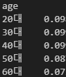
                 - 전부 연령별로 10% 미만.
                 - 평일 점심과 주말점심도 찾아봐야함 (진행할 것)

     - 분석 지표 세번째, '비교군(Benchmark) 활용'
         - 이전에 2030의 가설 중 하나는 넉넉한 자본이 없기 때문에 보상심리/이벤트 로써 폭발적인 매출을 기록한 것인지 확인해야 한다고 했음.
         - 이를 위해, 실험군으로 저가업종(패스트푸드) 선정과 Luxury 지표 제작
         - Luxury 지표는 ```심리적 허용 기준치``` 로써 전형적인 '플렉스(Flex)' 성향을 확인할 수 있음.
         - 공식 : 고기저녁ATV/패스트푸드점심ATV
             - ※ 데이터프레임에서 ATV를 계산하여 체크한 상태 (요일마다 5개씩 평일엔 25개, 주말엔 10개)
             - 연령별로 다시 ATV를 다 계산한 값을 보아야 함.
             - 하지만, groupby('age')['ATV'].mean()을 진행할 시 데이터 통계적 왜곡 현상 발생가능( 평균의 평균을 계산하는 것 )
             - 따라서, groupby('age')[['amt','cnt']].sum()을 진행하여 다시 ATV를 구함
             - 연령대별 총 매출액과 매출건수를 기반으로 하여 가중평균(Weighted Average) 적용하여 통계적 왜곡 최소화함.
         - 

         - 하지만, 패스트푸드는 '돈이 많아도 많이 쓸 수 없는 업종'임을 고려하여 보조지표 선정.
    
     - 분석 지표 네번째, '보조지표 cnt(럭셔리 노출률)'
         - ATV만 보면 "20대가 고기에 진심이다"라고 착각할 수 있음.
         - **'얼마나 자주 가는가(Frequency)'**를 봐야 그 진심이 '일회성'인지 '습관'인지 알 수 있음.
         - 공식 : 고기요리 총 매출건수 / 패스트푸드 총 매출건수
             - 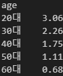
                 - 공식 :  패스트푸드cnt/고기요리cnt
                 - 즉, 고기요리보다 패스트푸드를 얼마나 더 먹는지를 나타낸 지표임.
                 - 4050은 1.75, 1.1로써 고기요리보다 패스트푸드를 약 1.7배, 1.1배 정도 먹는다 ( 즉, 비슷하거나 조금 더 많이 먹는다. )
                     - (가성비, 저가업종으로) 단순히 배를 채우는 것보다는 만족도를 위한 음식을 더 선호함.
                 - 하지만 2030과 60은 지표가 다릅니다.
                     - **2030** 고기요리 보다 패스트푸드(저가업종)를 약 3배, 2배 더 먹는다.
                         - 이는 평소에 패스트푸드로 식사를 대체하는 모습을 볼 수 있으며, luxury가 약 5.5배, 6배였던 것을 보아 고기요리는 '보상심리/이벤트'임.
                    
                     - **60** 고기요리를 패스트푸드보다 약 0.68배 먹는것으로써, 즉, 고기요리를 더 자주 섭취함.
                     - 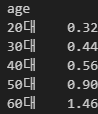
                         - 해당 지표는 고기요리cnt/패스트푸드cnt 입니다.
                         - 즉, 패스트푸드보다 고기를 얼마나 더 먹는지를 나타낸 지표임.
                             - 60대는 1.46배정도 더 고기를 자주 먹습니다.
                             - 60대는 '이벤트'가 아닌 '친숙한 요리'에 가까움.
    
     - 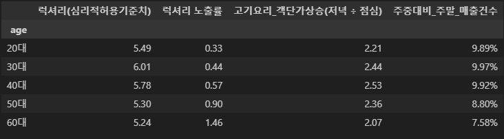
         - 패스트푸드 점심(11-13시)의 매출건수는 높고 고기요리 저녁(19-21시)에서는 낮아 0.3의 비율을 기록
         - 하지만, 매출액 상 고기요리는 약 15억(14.9억)이고, 패스트푸드는 점심에 약 3억, 저녁에 약 4.5억임
	     - 건수는 높지 않으나, 매출액의 압도적임을 보아 "점심엔 가성비", '보상심리/이벤트'로 고기에 지출함 (Flex 성향) -> 이런 현상은 일식에서도 나타날 것(데이트)

 - 해설 및 평일점심과 주말저녁을 이용한 타겟마케팅전략 수립
 - 해설
 - 분석 결과 : 연령별로 상이한 '고기 소비 메커니즘'이 발견됨
     - 2030 세대: 극단적 보상 소비형
         - 근거: 럭셔리 노출률이 0.3~0.4로 매우 낮음에도 불구하고, 럭셔리(심리적 허용기준치)는 5.5~6.0으로 전 연령대 중 최상위권임.
         - 통찰: 일상에서 패스트푸드로 가성비를 지향 혹은 지출을 억제하다가, 고기 요리를 먹을 때는 평소 식사보다 무려 6배나 비싼 금액을 지불함.
             - 즉, 고기 요리는 이들에게 단순한 영양 섭취가 아닌 **'심리적 보상과 이벤트'**입니다.
        
         - 20대의 럭셔리 노출률은 최저(0.32 로 꼴등임)이나, 럭셔리 지수는 5.49로 매우 높음
             - luxury 3등

         - 30대는 럭셔리 지수가 6.01로 전 연령대 중 가장 높으며, 객단가 상승률(Multiplier)도 2.44로 매우 높음(30대가 Multiplier 2등).
	        - 럭셔리 노출률은 (5개 중 4등)
        
     - [인사이트]
         - 30대의 'Golden-Hour' 집중 현상
             - 30대는 주말 저녁 객단가 상승폭(Multiplier)과 심리적 허용치(luxury)가 동시에 정점에 달함.
             - 이는 30대가 단순 회식이 아닌, 기념일이나 데이트 등 **'목적형 고가 소비'**를 주도하고 있음을 시사함.
             - 이전 Multiple_Line그래프 확인 결과 30대는 50대와 매출총액이 거의 같았음.
         - 결론: 매출 폭발력 측면
        	 - 20대는 '절약 후 한 번의 플렉스'를 하지만, 30대는 이미 소비력이 갖춰진 상태에서 **'가장 화려한 외식'**을 즐기는 핵심 타겟군(Big Spender)임이 입증됨.

```text
luxury
20대    5.487998
30대    6.008439
40대    5.779581
```

 - 4050 해석
     - 4050 세대: 일상적 가치 소비형
         - 근거: 럭셔리 노출률이 0.6~0.9로 높고, 객단가 상승률(Multiplier)이 2.5 수준으로 높게 유지됨
         - 통찰: 주말 저녁 객단가 상승폭이 크다는 것은 가족 단위 혹은 모임 위주의 소비가 강력하다는 뜻.
             - 이들에게 고기는 20대만큼 '희귀한' 경험은 아니지만, 여전히 주말의 중요한 **'메인 이벤트'**임.
        
     - 60대 : 추가분석 필요
         - 근거: 럭셔리 노출률이 1.46으로 패스트푸드보다 고기를 더 자주 먹으며, Multiplier와 luxury 수치는 가장 낮음.
             - 하지만, 연령이 높을수록 고기 소화율은 떨어지는 것으로 알고있으며, 그 경계선이 60대인지 확인이 필요할 듯 싶음.
        
         - 통찰: 60대에게 고기 요리는 특별한 날 먹는 음식이 아니라 **'일상적인 주식'**에 가까움.
             - 평일 점심과 주말 저녁의 가격 차이가 크지 않은 안정적인 소비 패턴을 보임.
             - 하지만, 잇몸 및 치아 약화, 소화율 저하 등의 현실적인 요인을 고려했을 때 일반적인 고기일 지 고민해야함.
                 - '소화가 잘 되는 고기', '식감이 부드러운 부위', '저염/저지방/무첨가' 등의 가능성 존재. (일반적인 고기와 다를 가능성 존재)
    
     - [인사이트]
         - 60대의 '고기 요리의 단골'
             - 60대의 럭셔리 노출률이 1.46이라는 것은 패스트푸드보다 고기를 더 자주 먹는다는 뜻.
             - 그러나 Multiplier가 2.07로 가장 낮다는 점은, 이들에게 고기 요리는 특별한 '이벤트'가 아닌 **'일상적인 단백질 섭취원'**임을 의미함.


 - 가설검정
 - 2030에게 고기 요리는 이들에게 단순한 영양 섭취가 아닌 **'심리적 보상과 이벤트'** 가 맞는가? ( 평소 식사에 비해 나타난 6배의 금액차이가 우연이 아닌가? )
     - T-test 선정
         - 패스트푸드의 분산은 대체로 비슷함.
         - 고기 요리는 식당마다 가격 편차가 매우 큼. 따라서, Welch's T-test 검정 수행
     - 가설
         - 귀무가설 : 차이가 없거나 패스트푸드가 더 비싸다
         - 대립가설 : 고기 요리가 더 비싸다
```text
Welch Two Sample t-test

data:  ATV by group
t = -77.262, df = 2918.2, p-value < 2.2e-16
alternative hypothesis: true difference in means between group FastFood(Lunch) and group Meat(Dinner) is less than 0
95 percent confidence interval:
     -Inf -57278.6
sample estimates:
mean in group FastFood(Lunch)    mean in group Meat(Dinner) 
                     14663.50                      73188.44 
```
 - **Welch's T-test 해설**
     - p-value가 유의수준 0.05보다 훨씬 작은 2.2e-16이므로 귀무가설을 기각한다.
     - __*alternative hypothesis: true difference in means between group FastFood(Lunch) and group Meat(Dinner) is less than 0*__
         - 고기 요리(Meat)의 평균 지출액이 패스트푸드(FastFood)보다 통계적으로 유의미하게 더 크다.
     - 따라서 매출총액의 6배는 우연이 아니며, 통계적으로 유의미하다.


 - **타겟마케팅전략 수립**
     - 2030
         - 전략 : 2030 'Small Luxury & Flex' 패키징
         - 방향 : 가격 할인보다는 **'압도적 비주얼'**과 **'희소성'**에 집중
             -  "한 달에 한 번, 나를 위한 선물" 컨셉의 프리미엄 세트 메뉴 구성. SNS 인증이 가능한 화려한 플레이팅과 사이드 메뉴 결합 상품 출시.

         - 근거 : 럭셔리 지수(6.00)가 높으므로, 가격 저항선이 타 연령대보다 높습니다. 비싸더라도 확실한 만족감을 주는 것이 핵심.
     - 20
         - 전략 : 20대 타겟 '스몰 럭셔리 게이트웨이'
             - Flex 성향과 더불어 금액 걱정 -> 자주 와야하는 스탬프보다는 1시간 이상 먹으면 할인등의 전략 
             - 패스트푸드처럼 접근이 쉽지만 고기 요리의 럭셔리함을 느낄 수 있는 미니멀한 구성.
         - 방향 : 고기 요리에 대한 노출 자체가 적은 세대이므로, 첫 방문을 유도하는 것이 중요
         - 근거 : 럭셔리 노출률 0.32 (최저치).

     - 30
        - 전략 : 30대는 비용 지불 용의가 가장 높으므로, "남들과는 다른 프리미엄 경험"을 제공하는 데 주력해야 함.
             - '한정판 부위 세트' 및 '전문 서버링 서비스'.
             - 주말 저녁 한정 '셰프 추천 특수부위 오마카세' 구성.
        - 근거 : luxury 6.01 (최고치), Multiplier 2.44 (매우 높음).

    - 4050
         - 전략 : 'Premium Family' 로열티 강화
         - 방향 : 주말 저녁의 **'가족 단위 만족도'**를 높이는 프리미엄 서비스.
         - 근거 : Multiplier가 최고점(2.53)이므로, 주말 저녁의 대규모 지출을 기꺼이 감수하는 연령대임.

    - 60
        - 전략: 방문횟수를 이용한 혜택
             - 방문 횟수에 따른 스탬프 적립
             - 점심 시간대 건강식 고기 정식 할인 등 빈도 기반 혜택
        - 방향: 특별함보다는 **'신뢰'**와 **'일상적 방문'** 유도
        - 근거: 럭셔리 노출률(1.46)이 압도적이므로, 우리 매장을 '단골'로 만드는 것이 매출 안정화의 핵심임.

### TIL (간단한 Keyword 정리)
 - T-test 수행 및 유의미한 통계적 근거 산출
 - 연령별 따른 고기요리 타겟마케팅전략 수립

## 트러블슈팅 (Troubleshooting)
### 1. 데이터 구조 + 평균의 평균(mean of mean)
 - **문제 :** 
     - Series와 DataFrame을 pd.concat() 연결 불가
     - ATV를 Series로 계산불가
     - ATV 컬럼을 연산하지 않고 다시 ATV를 가져올 수 없음

 - **원인 :** 
     - meat_dinner_df, fastfood_df가 2차원의 데이터프레임이라 연산 불가능
     - 이미 평균을 낸 ATV 컬럼에 다시 mean()을 사용할 경우 통계적 데이터 오류 발생 가능성

 - **방법 :** 
     - 컬럼만을 재선택하여 Series로 제작
     - 연령대별 총 매출액과 매출건수를 기반으로 하여 가중평균(Weighted Average) 적용하여 통계적 왜곡 최소화함.

 - **결과 :** 
     - 데이터 전처리 및 연결
     - amt와 cnt를 다시 추출하여 통계적 왜곡 최소화


## 추가 공부
- [x] 데이터프레임 출력시 줄바꿈문자(\n) 작동 x : Jupyter Notebook에서 데이터프레임이 출력될 때, Pandas는 이를 HTML ```<table>``` 태그로 변환
     -> HTML에서 줄바꿈 문자(\n)는 브라우저에서 렌더링될 때 실제 줄바꿈으로 나타나지 않고 공백 한 칸으로 처리
        -> 데이터프레임에서 줄바꿈을 위해 ```<br>```을 사용해야함

# 📅 개발 및 학습 일지 (Development Log)
## 24.Dec.2025 [DAY-17]
## ✅ 한 일
 - [x] R 카이제곱검정
 - [x] 세부 업종 분석 시작
 - [x] 작업환경 변경

## 배운점(TIL)
 - 전체 그래프
     - ### 성별은 '남자', 'M' 으로써 남자 성별을 먼저 분석중
     - 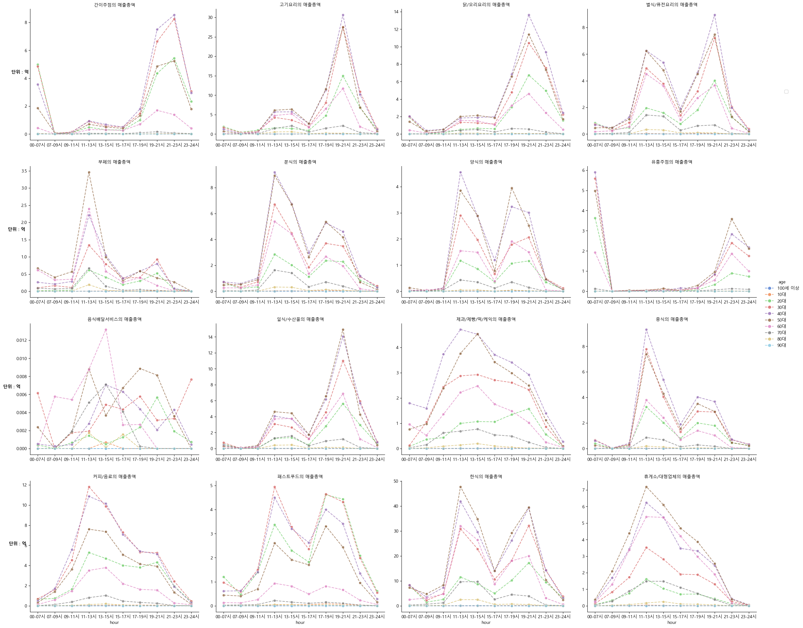
     - 해당 소형다중차트 라인그래프를 매출총액, 매출건수로 나누어 요일별, 시간대별로 제작 ( 한 주제당 16개 업종 * 4세트 )
     - 업종 별 그래프를 비교 시도
         - 기존 패턴과 다른 업종들을 먼저 찾아 분석 설정( 수박겉핥기 )
             - 찾아낸 정보가 과도하고 너무 많아 업종별 그래프 해석 및 타겟팅전략 도출 시 참조예정.
         - 하지만 과도한 정보량과 떨어지는 가독성으로 정보를 많이 뽑아낼 수 없었음
         - 그래프의 모양 및 추이 관찰을 목적으로 변경

 - 고기요리 세부업종 그래프 분석
     - 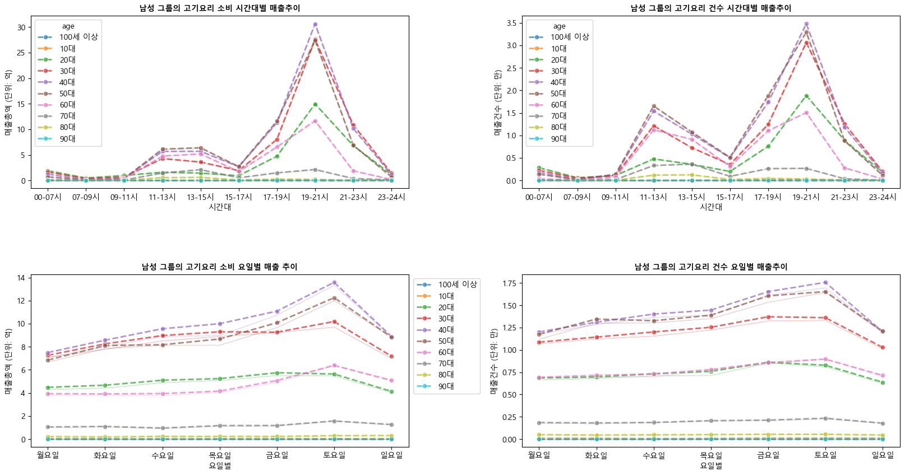
     - 과도한 정보량으로 인해 더 나은 관찰과 가독성을 위한 업종 별 관찰(세부업종 분석)을 시작함.
     - <해석>
     - 고기요리의 주 손님은 20,30,40,50,60대이다.
     - 고기요리의 점심 매출건수는 약1.5만이고 저녁건수는 약 3.5만이지만, 매출금액에서의 차이는 전체적으로 약 6배 차이가 난다
         - 고기요리는 저녁에 소비가 활발하다.(퇴근길 / 회식 / 모임 등)
     - 그 중, 20대는 점심 매출건수에 기여한다고 보기 어렵다.(매출건수와 매출총액이 너무 낮음.)

     - 
         - 30대가 ATV 1등 (71,539원), 40대가 ATV 2등(69,401원), 20대는 ATV 3등(67,357)이다.
         - 50대는 ATV가 4등임에도 불가하고 많은 양의 매출건수와 매출총액으로 순위가 높다.
     - 60대의 매출 건수는 '고기요리 건수 요일별'을 보면 알 수 있듯 20대와 동등하거나 그 이상이지만, 실질적인 매출은 대부분 20대가 높으며, 그 결과물은 모든 그래프에서 나타난다.
     - 20대와 60대의 금액은 3억차이이고, 60대는 시간대별로 고루고루 분포하여 매출건수와 매출총액을 책임지며 20대는 저녁시간에 폭발적인 금액을 사용한다.
     - 피크타임을 제외하고 나머지 시간에서 꾸준한 매출은 60대가, 폭발적인 매출은 20대가 담당한다고 보는 것으로 해석할 수 있다.

 - R 카이제곱 검정
     - 해석 중 ```20대는 점심 매출건수에 기여한다고 보기 어렵다.(매출건수와 매출총액이 너무 낮음.)```
     - 즉, '20대의 점심 매출 기여도는 주 소비층에 비해 현저히 낮으므로, 마케팅 자원은 저녁에 집중해야 한다' 라는 해석을 했습니다.
     - 카이제곱검정을 통한 통계적 검정.

```text
카이제곱 검정 결과
[1] "=== [통계 검증] 카이제곱검정 결과 ==="
Pearson's Chi-squared test with Yates' continuity correction
==============================================================================
data:  contingency_table```
X-squared = 535.25, df = 1, p-value < 0.00000000000000022
           Lunch Other
20s         9.95 90.05
Main_Group 16.70 83.30"""
==============================================================================
p-value (유의확률): p < 2.2 * 10^-16
```
 - 카이제곱 검정 해석
     - 기존 가설 : ```20대의 점심 매출 기여도는 주 소비층에 비해 현저히 낮으므로, 마케팅 자원은 저녁에 집중해야 한다``` 
     - 20대 점심 소비: (비중: 9.95%) → 점심 고깃집 방문은 10명중 1명 미만
         - "통계 검정 결과, 20대의 점심 시간대 매출 기여도는 주 소비층에 비해 현저히 낮다는 가설입증."

     - 역으로 해석하면, 20대 소비의 90.05% (주로 저녁)에 집중
         - 그래프에 나타난 약 15억(14.9억)원의 90%는 저녁시간대에서 나온 것.
         - ※ 저녁 시간대 마케팅 효율은 점심 시간대 대비 최소 9배 이상의 잠재력을 가짐
         - "마케팅 자원은 저녁에 집중해야 한다는 가설입증."

     - 30~60대 점심 소비: (비중: 16.70%) → 점심에도 일정 수요 존재
     - 직장인 점심 회식, 가족 모임 등으로 인해 점심 시간대에도 고기 요리 소비가 일정 부분 발생

     - 통계적 유의수준 0.05(신뢰수준 95%)는 물론 0.01 (신뢰수준 99%)보다도 훨씬 낮다.( p-value < 2.2 * 10^-16 )

 - 따라서, 기존 가설을 채택한다.
 
 - [x] 타겟마케팅을 위해선 2030, 4050, 60+ 이상의 그룹이 소비패턴이 얼마나 다른지를 파악해야 함.
 - [x] 특히 4050은 단순히 경제적 여유와 지위에서 나오는 '많은 자본' 때문에 높은 매출인 것인지, '만족도'에서 지갑이 열리는 것 때문인지 파악해야 함.
 - [x] 반대로 경제적 여유와 지위가 상대적으로 덜 한 2030은 넉넉한 자본이 없이 때문에, 평소엔 가성비(패스트푸드)를 먹고, 보상심리/이벤트로써 고기요리에서 폭발적인 매출을 내는 것인지 봐야함. 
 - 만약, 파악할 수 있다면 각 연령에서 '프리미엄', '고기를 대신 구워주기', '조용한 룸 제공', '할인혜택' 등의 전략수립 가능.
 
### TIL (간단한 Keyword 정리)
 - 카이제곱검정을 통한 가설 및 전략 수립
 - 세부업종분석 시작
 - estimate와 ci를 통한 그래프 가독성 확보

## 트러블슈팅 (Troubleshooting)

### 1. 스파게티 차트
 - **문제 :** 16개 업종, 10개 연령대의 시계열 데이터를 한 번에 그리려다 보니 그래프가 난해해짐.
 - **원인 :** 제한된 캔버스(Canvas) 크기에 비해 정보량(Dimension)이 과다함.
 - **방법 :** '추이 관찰'을 '세부 업종'마다 살펴보는 것으로 변경
 - **결과 :** 가독성 확장으로 얻게되는 정보와 인사이트가 많으며, 타겟팅 전략 수립에 용이

### 2. 그림자
 - **문제 :**
     - 라인그래프 변수 line_df를 초기에는 line_df, line_df2로 나누어 hour(시간대), day(요일)로 나누었음
     - 이를 합치고 시각화하는 과정에서 그림자(Shadow)가 생겨 가독성 저하 (Bootstrapping 통계기법)
 - **원인 :** '12시'라도 **요일별로 7개의 데이터 ( 월 ~ 일 ) 7개가 있으며, 이를 신뢰구간을 그린 것.
 - **방법 :** sns.lineplot의 ```estimator=sum```, ```ci=False``` 사용
 - **결과 :** 데이터 무결성과 가독성 확보

### 3. 카이제곱 검정
 - **문제 :** 
     - 카이제곱 검정 데이터가 미집계
     - 카이제곱 검정 결과 데이터가 99% 손실되는 상황 발생 (약 15억 매출, 검정결과에서는 약 0.15억)
 - **원인 :** 
     - 'age'와 'hour'가 category 컬럼인 상태로 Parquet에 저장
     - 매핑정보의 불일치
     - 20대를 비교해야 하는데, 10대를 비교함.
 - **방법 :** 
     - as.character를 이용 타입 변경
     - 매핑 및 age 수정
 - **결과 : 카이제곱 검정 결과, '20대의 점심 매출 기여도는 주 소비층에 비해 현저히 낮으므로, 마케팅 자원은 저녁에 집중해야 한다'는 가설입증.**

### 4. Parqeut 파일 손상
 - **문제 :** 작업환경 변경으로 인한 Parquet 파일 손상
 - **원인 :** Parquet 파일의 구조적 특성(Binary Format)과 이메일 전송 방식(Encoding/Decoding)의 불일치
     - Parquet 파일은 스키마(메타데이터)가 파일의 맨 끝에 저장 -> 이메일 첨부파일은 용량/네트워크 등의 원인으로 끝부분이 미세하게 잘림
     - Parquet는 바이너리 -> 이메일은 텍스트 전송을 위한 설계였기에 인코딩 및 디코딩 -> 보안필터 혹은 복구과정에서 패딩 오류
     - 작성자가 파일을 백업하는 과정에서 모든 파일을 압축했었음 -> Parquet는 이미 압축된 고효율 파일임 -> 압축 해제 시 CRC(순환 중복 검사) 에러 유발 가능성 높임 -> Parquet의 필수 정보가 삭제가능성
 - **방법 :** ```Food_Analysis.ipynb``` 파일에 남겨둔 Parquet 제작기록을 통한 파일 복구
 - **결과 :** Parquet 파일 복구 및 분석가능 (다음 파일 이동시에는 클라우드스토리지 사용)

## 추가 공부
- [x] 패딩(Padding) : 
     - 컴퓨터나 네트워크(이메일 포함)는 데이터를 처리할 때 일정한 크기의 '블록(Block)' 단위로 쪼개서 처리
     - 데이터의 길이가 블록 크기의 배수가 되지 않으면, 남는 빈 공간을 **의미 없는 데이터(0이나 특정 문자)**로 채우는데, 이를 **패딩(Padding)**이라 함.
     - 이메일은 파일을 전송할 때 Base64라는 방식으로 인코딩하는데, 4글자씩 묶어서 처리하는 과정에서 4글자가 되지 않아 다른 기호 삽입 -> **패딩오류**
- [x] CRC(순환 중복 검사) 에러 :
     - CRC는 데이터 전송 과정에서 오류가 있는지 확인하기 위한 수학적 검증 기술. 
     - 파일을 압축하거나 전송하기 전에, 파일 내용 전체를 수학 공식(다항식)으로 계산하여 **짧은 숫자(Checksum)**를 만들어 파일 꼬리표에 붙임.
     - 이메일 전송 중 Parquet 파일의 비트가 하나라도 바뀌었다면, 계산 결과가 달라짐 -> **CRC 오류**

# 📅 개발 및 학습 일지 (Development Log)
## 21.Dec.2025 - 18.Dec.2025 [번외]
## ✅ 한 일
 - [x] 휴식
 - [x] 자격증 공부 및 디스코드 웹후크 설정
 - [x] 코딩애플 IT 공부 시청(GitFlow, Trunk-Based, 애니프사들을 코딩을 더 잘할까?, 해시와 salt개념)
 - [x] 바이브 코딩(ClickerGame, Minecarft_DragonEggSurvival_Plugins) 및 프롬프트 엔지니어링 공부(https://www.promptingguide.ai/kr/introduction/tips)

## 배운점(TIL)
 - 15일부터 18일까지 집중이 이례적으로 안되어 되돌아보는 시간을 가졌습니다.
 - 근 1년간 이별, 자격증 시험 불합격, 취준의 초조함, 대학교 과제 및 시험 등 지쳐있던 몸과 마음에 대해 제대로 휴식을 준 적이 없었다고 생각해 잠시 쉴 시간을 주었습니다.

 - 18일 ~ 19일
     - 독서와 산책, 친구와 수다 그 외에는 아무것도 하지 않고 온전히 휴식에 집중.
     - 즐겨보는 IT 유투버 중 코딩애플(CodingApple) 유투브와 다른 사람의 Github를 탐방하며 필요한 CS지식과 정보처리기사에 필요한 지식을 주로 보았습니다.
         - 코딩애플(Youtuber)
             - 지식쌓기용
                 - GitFlow, Trunk-Based 관련 (협업)
                 - index, 정규화, ```1.1 + 0.1 != 1.2인 이유``` 설명
                 - '수학포기자들은 코딩하면 큰일남'
                 - Bloom Filter

             - 재미
                 - '애니프사들은 코딩을 더 잘할까?'
                 - '내 스팀비번이 맨날 털리는 이유(해시, salt개념)
                 - '구글 검색은 어쩌다가 쓰레기가 되었나'

 - 20일 ~ 21일
     - 자격증 공부
         - 주말에는 정보처리기사를 병행중이였는데, 복습과 CBT풀이 정도로 진행했습니다.

     - 영어회화
         - 매주 일요일 저녁 영어회화 모임을 꾸려서 진행하고 있었습니다.

     - 웹후크
         - 평소에 AI에 관심이 많았고, 다른사람들은 어떻게 사용하는지 궁금했고 CS정보나 관련정보를 주기적으로 받고 싶었습니다.
         - Discord의 웹후크 기능을 사용하여 ['snack-prompt','reddit-locallama','open-cookbook','product-hunt','hugging-face']의 RSS주소를 받아 정보를 주기적으로 받도록 설정했습니다
    
     - 프롬프트
         - AI에게 물어보며 프롬프트 연구를 했고, 그 덕분에 필요할 때에는 대부분의 프롬프트를 커스터마이징해서 사용합니다.
             - 분석, 이미지 생성, 검색, 취약점 분석 및 문제제공, 코딩, 설명, 커리어 코치, 데이터 분석 등등
         - x1xhlol/system-prompts-and-models-of-ai-tools, GPTers 등 다른 사람들의 프롬프트를 살펴봄.
         - ```https://www.promptingguide.ai/kr/introduction/tips``` 해당 링크를 찾아 프롬프트를 연구했고, 현재도 주말 쉬는 시간에 진행중.
    
     - 바이브 코딩(Vibe Coding)
         - 'LLM Stats'에서 AI 성능 비교표를 확인
         - ClickerGame과 Minecraft의 DragonEggSurvival 플러그인(Plugin)을 제작해보았음
             - ClickerGame은 잘 작동하는 듯 하지만, 기능 분리, 모듈화 등이 되어있지 않은 One-Class 파일 -> 수정예정
             - Minecraft 플러그인은 '학교 컴퓨터' 이기에 테스트는 수행하지 못함.
             - 12월 23일에 자취방에서 본가 이동 후 테스트 예정
             - 프롬프트, 바이브코딩 결과물 등은 나중에 다른 프로젝트에 게시할 예정

### TIL (간단한 Keyword 정리)
 - 휴식
 - Vibe Coding
 - 자격증 공부, 영어회화,
 - AI와 프롬프트 공부
 - Discord에서 웹후크 -> 정보제공 자동화

# 📅 개발 및 학습 일지 (Development Log)
## 17.Dec.2025 [DAY-10]
## ✅ 한 일
- [x] 대용량 처리를 위한 그래프 학습(Treemap, Bubble, Small Multiples)
- [x] 고객 별 분석 시도(First_Order_Date)

## 배운점(TIL)
 - 16일부터 본인의 학습방법을 바꿈
     - **Before :** 인공지능에게 '데이터 분석 커리어 코치' 프롬프트를 부여하여 함수와 파라미터 힌트를 제공받아 학습
     - **After :** 모르는 함수를 제외하고는 힌트없이 알고리즘을 스스로 생성하고 제작

 - 1) 고객별 패턴 분석 연습
     - 현재 작업하고 있는 데이터에는 고객ID 등 식별할 수 있는 컬럼은 없음.
     - 하지만, 연습을 위해 파싱해서 집단분석을 진행함
         - 'M_20대_한식' / 'F_40_양식' 등 그룹 분리(Segmentation)
             - 본인의 방법 : 'sex', 'age', 'card_tpbuz_nm_2'를 groupby하여 추출
             - 최종결과 : 'Persona_ID' 를 만들어 각 해당컬럼을 더함 (df['sex']+df['age']+df['card_tpbuz_nm_2']) 
             - -> 학습한 함수와 양은 많으나 더 적절한 방법을 사용하지 못함 (닭 잡는데 소 잡는 칼을 쓴 격)
             - -> 첫 프로젝트라고 감안하더라도 더 많은 실무 경험과 pandas 도구 숙련도를 늘려야 함.
        
         - 최초방문날짜 컬럼을 제작해 피벗테이블 표로 비교를 시도
             - df.transform('min')을 사용해 최초방문날짜를 제작
             - 데이터의 크기와 Cohort분석은 월 단위로 진행한다는 것을 고려해 '월' 단위로 변경
                 - dt.month를 사용하면 2025-01월과 2026-01월의 차이가 없게 됨.
                 - dt.to_period('M')을 사용
             - 제작한 최초방문날짜와 ['ta_ymd']의 ```월 단위만 뽑아 만든 컬럼```과 'pivot_Table'로 비교
                 - 식별자가 없었기 때문에 특정집단을 같은사람처리함 -> 믿을 수 없는 자료
                 - 또, 데이터의 무결성 보증할 수 없었음.
    
 - 2) 집단 시각화 방법
     - 1. Treemap ( 직사각형 모양이지만, Series를 받음. )
         - 파일의 수가 어느정도 많으면 효과적인 대용량 처리 방법임.
         - PiePlot이 보기 어려운 이유 중 하나는 사람의 눈은 '각도(Angle)'와 '곡선(Arc)'의 크기를 비교하기 어려워함. 또, 네모난 면을 비교하는 것을 더 잘함

         - Treemap 폐기
             - 효과적인 것은 맞으나 Persona_ID는 258개 -> 하위 데이터의 롱테일(Long Tail) 이슈
             - 'etc' 라는 기타 범주로 묶어 해결할 수 있으나 그 수가 너무 많아 다른 방법 탐색.
    
     - 2. Bubble
             - 크기와 색상별로 구분지을 수 있어서 채택함
             - X축을 매출총액, Y축을 매출건수, hue='Persona_ID'로 하여 제작
            
        
         - Bubble 폐기
             - 그 양이 너무 많아 범례가 폭발 -> 'bbox_to_anchor 사용'
             - 색상도 많아 오히려 구분되지 않으며, 데이터가 겹쳐 가독성이 떨어짐
    
     - 3. Small Multiples
             - 카테고리 별로 작은 그래프들을 그려줌
             - '한식'의 압도적인 매출액과 건수때문에 가독성이 떨어졌음
                 - 'axes_dict'와 반복문으로 개별그래프에 접근 
                 - 'facet_kws'를 사용해 개별그래프 단위 초기화
        

         - 
         - Small Multiples 폐기
             - 여전히 많은 값으로 인해 가독성은 없었으나, 최고 라벨값을 추출함.

    **결론** 너무 많은 양의 데이터는 한꺼번에 시각화 하기 어려움(욕심) -> 카테고리 별로 분류해야 함.


### TIL (간단한 Keyword 정리)
 - Segment Cohort 분석(식별자 없어서 실패)
 - Treemap, Bubble Chart, Small_Multiples Chart
 - .to_period('M') / .nunique() / fillvalue=0 / facet_kws={} / axes_dict

## 트러블슈팅 (Troubleshooting)

### 1. 코드작성 스타일
 - **문제 :** 
     - 코드는 '짧게 써야 좋은 코드'라는 강박 
     - 같은 맥락으로, 중간변수를 최대한 만들지 않으려고 했으며 역설적으로 작업효율만 더 안좋아짐 ( 12줄 코드 작성에 3시간 )
 - **원인 :** 코드를 짧게 만드려는 과정이 코드작성에 방해
 - **방법 :** 코드가 길어지더라도 작성(알고리즘 구현) -> 구조적으로 올바른지 점검 -> 최적화 
 - **결과 :** 코드 작성의 규칙 생성

 ### 2. 주석의 부재
 - **문제 :** 오류를 찾기 어려움
 - **원인 :** 코드를 짧게 만드려는 방법은 논리가 암시적이게 됨.
 - **방법 :** 최종정리 프로젝트가 아니더라도 주석을 달고, 알고리즘 제작할 때의 논리구조도 미리 표현한 후 작성할 것. 
 - **결과 :** Cohort_Analysis에서 axes를 활용하여 4개의 그래프를 생성할 때, 수정에 용이했음.

 ### 3. pandas의 사용 미숙련
 - **문제 :** pandas를 사용한 변수나 결과를 예상하지 못하며, 쉽게할 수 있음에도 어렵게 감
 - **원인 :** pandas를 제대로 이해하지 못함.
 - **방법 :** 
     - 더 많은 경험
     - 수시로 생성한 변수와 결과값 확인
 - **결과 :** 아직 뚜렷한 결과는 없습니다.

 - **_총평_** : 도구 사용 미숙, 실무 경험 부족, 코드 스타일, 욕심(많은 데이터를 한번에 구현하고자 함)이 많았음.

## 추가 공부
 - [ ] Pandas 사용
 - [ ] 주석사용 습관화
 - [ ] 알고리즘 분리 및 코드 탈완벽주의 

# 📅 개발 및 학습 일지 (Development Log)
## 15.Dec.2025 [DAY-8]
## ✅ 한 일
 - [x] 월초/중반/월말 분리 및 분석
 - [x] 대용량 파일처리 (Parquet)
 - [X] 더위가설 수립 및 증명

## 배운점(TIL)
 - 가설 증명
 - '더위'가 사람들의 소비성향을 위축시켰다.
 - 고려해야 할 요소 (월급날)
 - 월 자본흐름 확인
     - pd.cut을 통해 구간 분리(월 초, 중반, 월 말) 7월 한달 자본 흐름 확인
     -  
          - 월급날과 가까운 중순일수록 소비가 주춤해지는 현상 발견
     - 6월 8월 검증
     - 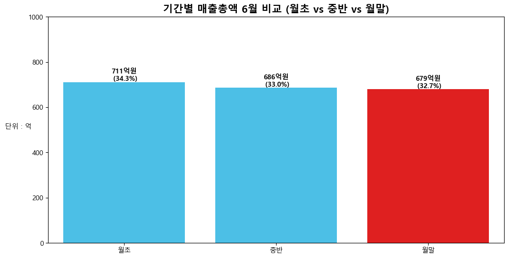
     - 
     - 세 구간 전부 중순에는 자본의 흐름이 약해지는 것을 관찰할 수 있음.

 - 이천시 막대그래프(더위떄문인지 확인)
     - 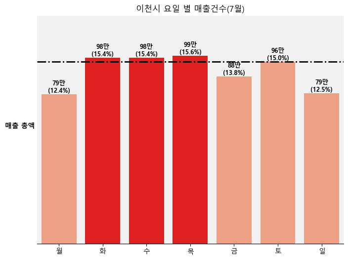
     - 7월은 6월, 8월에 비교했을 때, '화,수,목'이 높다고 했었음.
     - 하지만, 7월이 이상한 흐름인지 확정적인 결론을 내릴 수 없었고, 패턴을 찾지 못하였기에 1월~10월까지 현재 올라와있는 자료들을 전부 다운로드함(대용량 파일 처리 필요)

 - 대용량 파일 처리
     - 첫번째 난관
         - 10개의 대용량 파일을 어떻게 효율적으로 메모리낭비없이 사용할것인가?
         - DRY(Don't Repeat Yourself) 원칙에 따라서 직접 반복하는것은 무의미함.
         - 즉, 결국 '모듈화'를 선택했음.
    
     - 모듈화
         - SQL, R언어를 사용할 떄 '패턴 매칭'을 기억하고 파일 형식이 비슷한 점을 사용함.
         - 'data_loader.py' 파일을 제작하고, 패턴매칭을 위한 ```glob``` 모듈 사용
         - 또, 'sys', 'os' 사용법에 대해 숙지함.(\__file_\_ / os.path.join / dirname / abspath)
         - 메모리 사용량을 줄이기 위해 date, category 타입 변경 포함(결합도와 응집도때문에 고민했으나 나중에 수정할 때를 참고해 매핑자료를 따로 첨부함)
         - ```classify_period``` 라는 함수를 'data_loader.py' 안에 넣어놨는데, 언더바('_') 하나로 시작하는 것은 암묵적으로 '내부용' 이라는 것을 학습

     - 두번째 난관(Parquet)
         - Parquet 이란 무엇인가?
         - 이걸 왜 사용하는가 ?
    
    - Parquet(파케이)
         - '.csv' 파일은 사람이 읽을 수 있지만 컴퓨터에게는 "파싱(Parsing)"비용이 비싼 포맷
         - 파싱(Parsing) : 컴퓨터가 알아들을 수 있게 쪼개서 번역하는 작업
         - '.csv' vs 'Parquet'
             - 컴퓨터는 사람의 언어를 이해하지 못하므로 그를 번역하기 위해 CPU와 시간을 많이 사용함 ( 비싸다고 한 이유)
             - Parquet(파케이)는 컴퓨터가 이해할 수 있는 '모국어'같은 존재임.
         **1월~10월 데이터병합 7.8초**
         **Parquet를 통한 호출 0.7초**
    
    - 사전 집계(Pre-Aggregation)
         - Parquet를 통해 이해하기 쉽고 빠른 형태로 변환했어도 500만개 행을 다 읽는건 비효율적임
         - 따라서, 원하는 컬럼을 뽑아서 사용하는 것이 훨씬 좋음.
     **즉, Parquet는 나만의 데이터베이스**라는 비유를 들 수 있음.

 - 대용량 파일 시각화
     - Lineplot을 이용해 전체적인 흐름을 보고자 함.
     - 색깔은 hue='period'를 통해 해결했으나, '월~일' 까지의 표시를 해야했음.
     - 그냥 xticks()를 통해 조절한다면 이름표만 달은 것과 다름없음
     - 정렬기준을 만들고 적용시키고자 함.
         - 하지만, 원하는 대로 정렬이 되지않았음.
         - pd.Categorical(적용할 컬럼, Categories=정렬기준, ordered=True) -> 카테고리에도 정렬 부여

 - 그래프
     - 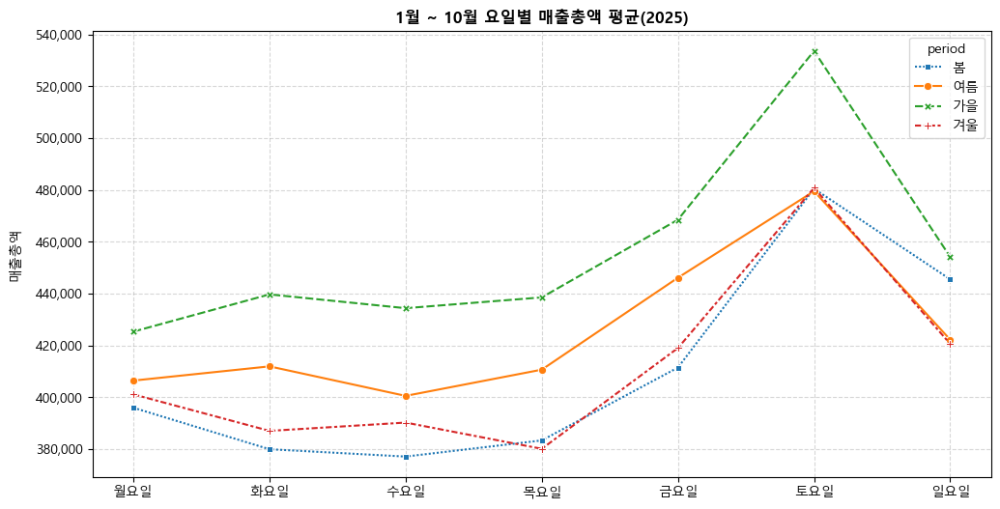
     - 
         - ※주의해야할 점
             - 데이터는 11월 12월이 빠져있어 가을과 겨울 집계가 정확하지 않음. (겨울: 1,2,12 / 가을: 9,10,11 / 봄: 3,4,5월 / 여름: 6,7,8월 )
             - 따라서, 합계보다는 평균을 바라봐야 함.
         - 가을 : 월~일 전 요일에 걸쳐 가장 높으며, 특히 주말(토요일)에 압도적인 피크를 찍음. ->
         - 2위 여름 (주황색 실선):주문 건수는 가을 다음으로 많지만, **매출총액 평균(객단가)**은 가을보다 낮음.
             -손님은 많지만, 가을에 비해 상대적으로 저렴한 메뉴를 소비하거나 소액 결제가 많다는 뜻.
         - 3위 봄(파랑) & 겨울(빨강): 전반적으로 비슷한 하위권을 형성함.
     
     - 가설 및 해석
         - 소비 횟수 측면에서 여름(주황색) 그래프는 바닥을 치지 않았음. 오히려 봄(파랑)이나 겨울(빨강)보다 주문 건수가 더 많음.
         - 더위 때문에 소비가 위축되었다면 여름 선이 봄보다 아래에 있어야 하는데, 실제로는 여름에 돈을 더 썼거나 비슷하게 사용함.
         - 즉, 더위가 사람들의 발길을 끊게 만들지 않았음. (가설 기각)
    
     - 새로운 인사이트:
         - 가을 역시 전부 집계가 되지 않았더라도, 매출건수와 매출총액 평균이 매우 높은 '돈이 되는' 성수기 계절임.(특수하게 소비가 폭발하는 시기 -> 왜인지 분석예정)
         - 이천시의 7월 데이터만을 보고 '평일 마케팅' 고려했으나, 오히려 '금,토,일'에 집중해야함.
             - 하지만, 계절상 '여름'이 평일에 강하고 매출건수와 매출총액이 높기 때문에 여름에는 '가벼운 프로모션' 진행을 할 수 있다.
         - '겨울'은 집계가 덜 되었다는 점을 감안하더라도, 월~일 내내 가장 바닥에 있었음.
             - 즉, 사람이 안오는 것과 동시에 적게 쓴다는 것
             - 객단가를 강제로 높이는 세트 메뉴(Upselling) 구성을 고려할 수 있음.
         - '일요일'에 손님은 금요일보다 더 많이 오는데, 돈은 덜 사용함.
             - '목/금'요일은 회식과 술자리 위주로 테이블 단가가 높지만, '일요일'은 다음 날 출근을 고려해 술을 덜 마시고 가벼운 식사를 함.
             - 회전율을 높이는 전략 고려 가능.

### TIL (간단한 Keyword 정리)
 - 데이터 용량 처리(Parquet, data_loader.py)
 - 가설 기각 및 인사이트 도출
 - pd.Categorial(), pd.cut() 학
## 트러블슈팅 (Troubleshooting)

### 1. 대용량 파일처리
 - **문제 :** 많은 양의 '.csv'파일을 처리하는 방법 고려
 - **원인 :** 메모리, 시간, 용량, 효율 낭비를 예방해야 함.
 - **방법 :** glob 모듈을 통한 패턴 매칭과 Parquet
 - **결과 :** Parquet를 통한 호출 0.7초 (가장 빠른 시간)

### 2. 지식의 깊이(실무경험)
 - **문제 :** 대용량 파일 처리 전체
 - **원인 :** 처음으로 마주하는 빅데이터와 모르는 단어들이 많았습니다.
 - **방법 :** AI에게 물어본 후 문법 공부 및 일일이 타이핑
 - **결과 :** Parquet, glob모듈, 대용량 파일처리 

## 추가 공부
 - **파싱(Parsing):** 비정형 문자열(Raw Data)을 문법 규칙에 따라 의미 있는 구조(Structured Data)로 변환하는 과정.
 - **pd.Categorical:** 요일(월~일)과 같이 순서가 있는 데이터(Ordinal Data)를 정렬할 때 사용하는 판다스 기능.


# 📅 개발 및 학습 일지 (Development Log)
## 12.Dec.2025 [DAY-5]
## ※DEV_LOG 파일 및 파일정돈 (구조화 적용일) [TIL 참고]
## ✅ 한 일
 - [X] Monorepo(모노레포)도입
 - [X] Rename Refactoring (리네임 리팩토링)
 - [X] 사용자 코드 조각(User Snippets) 

## 배운점(TIL)
 - 비효율성
     - 'config.py', '.csv', 'my_plotting.py' 등을 매 프로젝트마다 파일 입력은 비효율적이라고 느낌
     - 결과물이 아닌 프로젝트가 여러개 생성되는 것 역시 무의미
     - 불러오기를 사용하기 위해선 파일 구조를 개선해야 한다고 느낌
     - 새 프로젝트 마다 'origin', 'git init', 'git remote add' 등 반복적인 git 명령어 사용과 발생하는 오류
     - 사용자의 실수로 이전 프로젝트에 덮어씌울 가능성 존재
     
 - Multirepo -> Monorepo
     - Monorepo 선택이유는 다음과 같음.
         - 지속적으로 업데이트 되어야 하고, 파일을 한 곳에 저장한 후 불러오기를 사용해야함 -> 불필요한 용량 낭비 방지
         - ```README.md``` 파일을 한눈에 보고 싶음 -> ```DEV_LOG.md``` 로 통합하고 대체함.
         - 파일 작업 현황을 한 눈에 볼 수 있어야 함 (유저와 본인)
         - 파일 수정과 작업에 용이해야함.
         - 다음 프로젝트 진행 시 ' 더 알찬 프로젝트 ' 들로 Git을 채울 수 있음 등

 - Monorepo & Rename Refactoring 
     - 


     - ```00_Common_Data``` -> 작업 데이터 파일 '.csv'
     - ```01_Shared_Lib``` -> 자주 사용하는 모듈과 이름 변경
         - 'config.py', 'my_plotting.py' -> [['constants.py','barh_plot.py']] (매핑자료, barh 시각화 함수)
     - 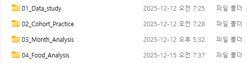
     - ```02_src``` -> 프로젝트 작업들 (데이터 분석연습 및 프로젝트)
     - ```03_Docs``` -> 문서 작업으로써 ```DEV_LOG.md``` 파일 위치
     - ```99_Archive``` -> 저장소 및 폴더 정돈을 위한 폴더 (난잡 방지)

 - User Snippets
     - import와 메모리 사용량을 위한 타입변경은 여전히 매 프로젝트마다 해야하는 번거로움
     - Snippets 사용
         - 'init_ds' 사용 시 모듈 호출과 타입변경코드 나옴
             - 1. 모듈 호출 적용
             - 2. 'ctrl + /' -> 주석 제거 후 타입변경 코드 적용


### TIL (간단한 Keyword 정리)
- Monorepo
- Rename Refactoring
- User Snippets
- File Structuring

## 트러블슈팅 (Troubleshooting)

### 1. 파일중복
 - **문제 :** '.csv'파일을 새 프로젝트가 시작할 때마다 복사해서 넣어야 함 (용량낭비)
 - **원인 :** 진행하는 프로젝트 수 만큼 파일을 붙여넣기 때문(이를, Multirepo 방식이라고 함)
 - **방법 :** Git이라는 최상위 폴더에 통합, 파일 정리 + Rename Refactoring 
 - **결과 :** 용량을 효율적으로 사용하고, 번거로운 작업을 반복하지 않게 됨.

### 2. Snippets
 - **문제 :** 새 프로젝트마다 import와 카테고리 타입 변경이 비효율적임.
 - **원인 :** 필요한 내용(필요 코드)을 미리 저장하지 않았기 때문임. 
 - **방법 :** VSCode의 User Snippets 기능으로 초기 설정 코드를 자동화
 - **결과 :** `init_ds` 키워드 입력 시 필수 라이브러리와 전처리 코드가 자동 완성되도록 설정함.
    - 환경 설정 시간이 **1분에서 3초로 단축**됨.
    - 모든 프로젝트에서 **동일한 표준 설정**을 강제하여 일관성 유지.

## 추가 공부
 - User Snippets (사용자 코드 조각)
     - 단축키(키워드)로 불러오는 초기 설정임.
     - 오타를 방지하고 속도, 표준화를 위해 많이 사용하는 VSCode 내장기능. IDE(통합 개발 환경)에 대부분 내장되어 있음.

# 📅 개발 및 학습 일지 (Development Log)
## 11.Dec.2025 [DAY-4]
## ✅ 한 일
- Matplotlib 객체 지향 방식(`ax`)과 이중축(`.twinx()`)을 활용한 심층 시각화(`진행 방향 결정`) 구현
- 요일별/일별 매출 패턴 분석 및 타 월(Month) 데이터와의 시계열 일관성 확인
- 디렉토리 구조 리팩토링 (`src`, `data`, `images` 분리)

## 배운점(TIL)
 - **이중축(Duelaxis)**그래프 도전
 - **객체생성** ax2, ax1
     - ax1 도화지에는 barplot, ax2 도화지는 ax2 = ax1.twinx() 적용
         - '.twinx()'는 서로 단위가 다른 두 데이터를 하나의 그래프에 겹쳐 보고 싶을 때 사용
         - 즉, ax1 도화지에 ax2를 같이 사용함.

 - 일 컬럼
 - 기존 df['ta_ymd'] 컬럼을 사용하기에는 너무 길다는 문제점이 있음
     - 전부 7월의 데이터이므로 title에 2025년 07월이라고 명시
     - pd.to_datetime(df['ta_ymd'], format="%Y%m%d) 함수로 데이터 포맷
     - df['ta_ymd'].dt.day -1 적용(index 맞추기 위함)

 - 막대그래프
     - 막대그래프는 '#4c72b0' 색으로 매출총액을 나타냄
     - plt.axvline()을 사용하여 일주일이 지나면 검정색 선(linestyle='-.')으로 표시
     - '매출총액' 글자가 겹치자 rotation=0(수평), labelpad()=10 으로 조정하여 해결함.

 - 라인그래프
     - 라인그래프는 'orange' 색으로 매출건수를 나타냄
     - ax2.tick_params(axis='y', labelcolor='orange') 적용 -> y축 사용 / y축 레이블 색은 주황색
     - '매출건수' 글자를 rotation=0 (수평)으로 조절함

 - 그래프 조정
 - 발표용 강조 자료
     - 기존 막대그래프들에게 '#6f9dbd' 색깔 적용 ( 기존보다 연함 )
     - bar와 line의 투명도를 'alpha=0.7'로 설정함
     - 특정강조 그래프에는 'red' 색깔 적용
     - axvline()은 4구간이 있었으나 if문을 적용하여 하나만 범례에 띄웠음.
     - [막대그래프 도화지] ax1.set_xticklabels(range(1,32)) 가로축 조정

    **전체 흐름 시각화로 인해 상세분석할 날(일)과 프로젝트 분석 방향을 정할 수 있었음**

 - 결과 및 해석
         - 
         - 1. 토요일은 매출건수도 높고, 매출금액도 높다
         - 2. 일요일은 매출건수는 적으나, 그에 비해서는 매출금액이 높다. 하지만, 일주일 중에서는 매출금액이 가장 적은 날이다.
            - 
         - 3. 화,수,목은 큰 변화없이 꾸준한 크기와 비교의 모습을 보임
         - 4. 쉬는 날이 가까워질수록(다음날이 쉬는 날 일수록) 매출건수와 매출금액은 증가하는 편이다.

    - 가설
    - 14일 - 20일까지는 **'더위'가 사람들의 소비성향을 감소시켰다.**( '특이일', '이벤트'같은 날들이 매출에 영향이 있다는 가설아래 )
         - 근거
         - 
         - 1. 다른 주 금,토요일에 비해 18일, 19일은 매출총액과 매출건수가 확연히 줄어들었다.
         - 
         - 2. 다른 주 화,수,목요일에 비해 15,16,17일은 감소하는 모습을 보인다.
      - 3. 2025년 7월은 '삼복 중 초복'으로 매출이 상승하는 캘린더 효과(Calender Effect)가 있었어야 할 것이다.

         - **생각해야 할 가능성**
             - 절대적인 '매출총액'의 값이 낮은 것은 사실이나, 다른 주 '금', '토' 매출 건수에 비해서 '매출총액'은 높은 편
                 - '18일' 금요일은 대체로 건수는 적으나 총액은 비슷함.

             - '월급날'의 영향
                 - 사람들의 지갑은 '월급날'에 가까울 수록 가벼워 질 것임
                 - 심화분석 :  월 초/ 중순 / 월 말 그룹화를 통해 매출총액 비교


     - 일요일의 '객단가'는 가장 높을 것이다.
         - 근거
         - 1. '토요일'은 건수와 매출총액이 같이 상승하는 모습
         - 2. '일요일'은 건수는 낮은 것에 비해서 매출총액이 높은 모습

 - **요일별 매출총액/매출건수 비교**
 
 - 요일 별 막대그래프
     - 막대그래프는 '#ff9873' 색으로 색칠, 강조 색깔은 'red'임
     - df['day'] 컬럼이 'category' 였기 때문에 또 다시 ㄱ,ㄴ,ㄷ 순으로 정렬
     - 값이 월,화,수, ... 일 순으로 정렬되어 있지 않아 값으로도 정렬 불가능

 - 요일 정렬
     - my_order[월-일] 생성 후 order=my_order 도입
     - plt.text에서도 정렬이 되어있지 않아 .reindex(my_order)로 정리
 
 - 그래프 조정
     - 몰입도를 위해 ax.patch.face_color / ax.face_color를 사용해 '#f0f0f0ed'로 색깔 조정
     - axhline()으로 표시하여 발표자료로써 이해하기 쉽게 만듬

 - 결과 및 해석
     - 
         - 대부분 화,수,목 은 꾸준한 지표를 차지(15.7%/15.5%/15.5%)했으며 금,토에 매출건수와 매출총액이 많이 증가함.
         - 즉, 이천시의 2025년 7월은 평일에 마케팅을 고려할 수 있음

     - 검증 (다른 월도 그러한지 6월, 8월 데이터를 가져와 시각화)
     - 
     - 
         - Colab 환경에서 제작했던 '수원시'의 요일별 그래프 역시 그러함. 
         - 6월, 8월 그래프는 화,수,목요일이 '토요일'을 넘긴적이 없었음.
    
     - 가설
     - 반드시 202507월에는 평소의 '금', '토'일을 이기는 무언가가 있었을 것이다.
         - 특히, 16일과 17일에 '초복'으로 인한 사람이 몰렸을 수 있다.

 - 파일정리
 - 현재 구조의 비효율성
     - 파일들을 넣을 정확한 명칭을 찾음
     - 'images' 폴더를 만들어 사진들을 정리
     - 'data' 폴더를 만들어 '.csv'파일 정리
     - 'src' 폴더를 만들어 '.py' 모듈 정리


### TIL (간단한 Keyword 정리)
 - 객체지향방법 + .twinx()로 이중축(Duelaxis)그래프 생성
 - 심화분석할 날(일) 탐색 및 프로젝트 진행방향 결정
 - 요일별 막대그래프 생성
 - reindex(), my_order 생성으로 커스터마이징 정렬
 - 같은년도 다른 월 데이터로 요일별 그래프의 이상 검증(탐지)
 - axvline, axhline 으로 구분 및 기준 생성 ( 범례는 하나 )
 - 데이터포맷 및 투명도 조정, 강조색상 사용으로 그래프 강조
 - 'images', 'data', 'src' 등 폴더를 만들어 정리

## 트러블슈팅 (Troubleshooting)

### 1. 정렬방법
- **문제 :** df['day']는 'category'타입에 값이 들쭉날쭉해 값으로도 정렬 불가
- **방법 :** my_order로 원하는 정렬기준 생성
- **결과 :** 원하는 방식으로 정렬 + plt.text에 '.reindex(my_order)' 사용으로 텍스트 정렬

### 2. 값
- **문제 :** df.items()를 사용하지 않으면 개인적으로 값을 꺼내기 힘들어 했음
- **방법 :** iloc / loc 사용법 숙지
- **결과 :** 원하는 값 꺼내기 용이해짐.

### 3. 인덱스
- **문제 :** bar와 line 그래프의 인덱스가 일치하지 않는 문제(범주형, 수치형이기 때문)
- **방법 :** df['ta_ymd'].dt.day -1 적용
- **결과 :** 분석 데이터 왜곡현상 해결

## 추가 공부
 - [x] ax.set_ticks -> 눈금(Tick)이 찍힐 **'수학적 좌표(위치)'**를 정함
 - [x] ax.set_ticklabels-> 위에서 정한 위치에 적힐 **'글자(이름표)'**를 정함
 - [x] ax.set_label -> Y축 전체를 대표하는 **'제목'**을 달아줌.
 - [x] ax.tick_params -> 눈금(Tick)과 눈금 라벨(Label)의 스타일을 **미세 조정**함.

# 📅 개발 및 학습 일지 (Development Log)
## 10.Dec.2025 [DAY-3]
## ✅ 한 일
 - [x] 매핑자료 'config.py', 그래프 시각화 함수 'my_plotting.py' 모듈화
 - [x] bar(barh) 학습
 - [x] 그래프 디테일 학습


## 배운점(TIL)
 - 그래프 생성
 - 새로운 프로젝트 파일을 생성하면 다시 매핑자료 입력과 한글설치를 하는 일련의 과정들이 너무 귀찮게 느껴짐
     - 따라서, 'config.py'를 생성해 모듈화 함.(매핑자료와 한글설치 함수생성)
     - import 라이브러리 역시 모듈화 하려했음 -> '네임스페이스 오염'과 '명시적인 중요성'으로 인해 사용 비추천 -> 오류찾기도 어려움
     - 
    **간단하게 시간을 절약하고 작업의 효율성을 증가시킬 수 있었음**
 
 - 분석하는 연령대를 나누어 'card_tpbuz_nm_1'분석 (세그멘테이션) 
     - 일반적인 상향식 막대그래프는 가독성도 떨어지고 보기 불편하다고 느꼈음
         - label의 갯수가 많아 가독성이 떨어지고, 금액확인이 어려웠음
     - barh(수평막대그래프) 처럼 눕히는 방법 선택 (sns.barplot은 x와 y값만 바꾸면 됨)
     - 큰 값에서 작은 값으로 정렬하고 싶으나 'category' 타입은 ㄱ,ㄴ,ㄷ 순으로 정렬
         - 첫 번째, 데이터전처리 :  ```groupby```를 할 때 .sort_values(ascending=False)
         - order = data.index 파라미터를 추가 -> '데이터 순서 = 막대 순서 = 색상 리스트'로 1:1 매칭

 - 생성한 barh 그래프가 밋밋
     - sns.color_palette('Blues_r', len(x)) 으로 그라데이션 색깔을 x개만큼 생성 (큰 값이 가장 진함)
     - 참고로 palette('색깔_r')에서 _r 은 reverse의 약자임. -> 큰 값을 가장 진하게 하고 싶을 때 사용
     - 그래프의 외곽선이 답답하고 불편함
         - plt.gca().spines['position'].set_visible(False)을 통해 제거하고 왼쪽 축만 남김

 - **저번 *추가학습* 때 배운 객체지향적 방법적용**
     - fig, ax = plt.subplots(figsize=(x,y))를 통해 ax (그래프를 그릴 도화지) 생성
         - 앞으로 ax의 세부 설정이 가능해짐
         - 그래프의 x축을 지우기 위해 plt.xticks([]) 사용
             - 하지만 plt.grid(axis='x')를 표현할 수 없었음.
             - ax.tick_params()를 사용하고, ax.grid(axis='x') 사용으로 x축 수직선 적용 및 해결
             - 한 눈에 약 n배 인 것을 파악 가능하게 됨
    **그래프에서 객체지향적 접근과 상세한 튜닝으로 가독성, 심미성, 전문성을 챙길 수 있게 됨**
 
 - 데이터 레이블링
     - plt.text(x, y, s, weight, ha, va) 학습
     - 반복문(for)과 `enumerate`를 활용하여 모든 막대 위치에 정확한 수치 텍스트(`ax.text`)를 자동 배치.
         - Before : 퍼센트(pct)와 금액 값을 리스트를 따로 제작하고 text에 기입 ( 2번의 반복 )
         - Think : 반복문이 2갈래로 갈린 것은 i번째 라는 순서때문임
         - After : 논리 구조 개선과 enumerate(df.items())를 통해 반복문 한번으로 기입.

 - 그래프 변수
 - 생성한 그래프에 집단마다 변수와 내용물을 바꿔줘야 함 -> VScode의 ```F2``` 단축키 역시 불편함
     - 생성한 그래프를 함수로 변환(data, "그래프 제목", ax, 색깔(기본은 Blues_r))
     - barh 그래프는 레이블이 많은 경우 자주 사용할 것 같아 'my_plotting.py' 모듈화

 - 'my_plotting.py' 수정사항이 있을 때마다 VSCode를 껏다 켜야 하는 불편함
     - importlib.reload(mp)를 통해 적용

    **유지보수가 용이해졌고 수정도 간단함**
    
### TIL (간단한 Keyword 정리)
- 'config.py', 'my_plotting.py' 모듈화
- seaborn 기준 bar(x, y, palette, ax, order) / plt.text(x, y, s, weight, ha, va) 학습
- plt.gca().spines['postion'].set_visible(), ax 객체지향적 방법 도입 -> 그래프 전문성, 심미성, 가독성 확보

## 트러블슈팅 (Troubleshooting)

### 1. 아쉬운 시각화
- **문제 :** plt.xticks([]) 사용 -> plt.grid() x수직선 사용불가
- **원인 :** plt.grid()의 선은 눈금(Tick)의 위치를 기준으로 그리기 때문임
- **방법 :** ax를 통한 객체지향적접근과 세부설정(ax.set_ylabel, ax.grid(axis='x', alpha=0.5))
- **결과 :** 그래프에 대한 전문적인 접근과 가독성, 심미성 향상 가능.

### 2. 비효율적인 코드
- **문제 :** plt.text를 사용하기 위한 비효율(2번의 반복문)
- **방법 :** 논리구조 개선, enumerate 함수 사용
- **결과 :** 비효율(2번의 반복) 개선
     - *[DAY-4]Month_Analysis 요일 별 막대그래프*
         - Before : '걸린 시간: 0.0458 초'
         - After : '걸린 시간: 0.0481 초'

### 3. 수정 적용
- **문제 :** 'my_plotting.py' 파일 수정마다 VSCode를 껏다켜야하는 불편함
- **방법 :** importlib.reload(mp)로 해결
- **결과 :** VSCode를 끄지 않아도 적용 가능

## 추가 공부
 - __pycache__ : 파이썬 인터프리터가 소스 코드(.py)를 컴파일하여 만든 **바이트코드(Bytecode, .pyc)** 저장소
  -> 다음에 프로그램을 실행할 때, 컴파일 과정을 건너뛰어 **로딩 속도(Start-up time)**를 높일 수 있음
   -> 소스 코드만 있으면 언제든 자동 생성 -> Git에 올릴 필요 없는 파일

# 📅 개발 및 학습 일지 (Development Log)
## 09.Dec.2025 [DAY-2]
## ✅ 한 일
 - [x] Git과 VSCode 연결
 - [x] 기본적인 EDA(탐색적 데이터 분석)
 - [x] 함수와 파라미터 학습


## 배운점(TIL)
 - HEATMAP
 - 나이에 따른 시간대 별 매출총액을 보고 싶었음
     - 하지만, 일일이 Line그래프로 보기에는 양도많고 불편하고 가독성이 떨어짐
     - Heatmap이라는 함수 채택
     - Parameter(파라미터) 학습

 - Heatmap에 ```groupby```된 결과를 바로 넣으려다가 오류 발생
     - Heatmap은 2차원 행렬 구조가 필요함 -> pivot_table 학습

 - Heatmap의 숫자가 너무 커서 ( + 지수 표기법 표현) 읽기 어려웠음
     - 단위를 천만으로 맞추고 단위를 표시함.
     - fmt 파라미터를 사용하여 숫자를 정리

 - Heatmap 숫자가 밋밋하다는 생각이 듦.
     - '*_kws'를 사용해 숫자크기, bold체 등 세밀하게 제어
     - 컬러바(범례) 유무 및 레이블 설정

 **연령에 따른 시간대 별 소비성향을 색깔을 통해 한눈에 파악할 수 있었음.**

 - Pivot_Table
 - Heatmap에 사용하기 위해 필요한 데이터 가공단계 ( SQL과 같은 기능 )
     - ```groupby()```는 세로로 긴 형태의 결과물 / ```Pivot_Table```은 2차원 매트릭스 형태로 펼쳐줌
     - index = 행 / columns = 열 / values = 교차지점의 값 / aggfunc = 계산방식
     - aggfunc의 기본은 mean(평균) -> sum(합)으로 바꿔주어야 의도와 일치함

 - sns.그래프형태
 - 상세한 그래프는 matplotlib, 빠르고 예쁜 시각화는 seaborn으로 작성 (Matplotlib기반으로 만들어진 라이브러리)
 - 파라미터에서 hue를 통해 간단한 값 분리를 할 수 있었음
 - color가 아닌 palette 파라미터로 색 조정 가능.
 
 - plt.axvline() (axv : 수직선, axh : 수평선)
 - 학습 중 마주친 새로운 함수였고, 강조와 구분에 탁월하겠다 생각해 학습함.

 - 그래프 원(￦) 표시 -> 깨짐 현상 발생
     - 한글폰트 설치와 마이너스 부호 깨짐 방지 코드 적용
    **한글로 된 매핑자료를 만들고 **시각화**와 **전처리**에 용이해짐**

 - 결과 및 해석
     - 
     - 이천시에서 결제가 가장 활발한 연령층은 **40대와 50대**이며, 경제활동 인구인 20대부터 은퇴 연령층인 70대까지 모두 일정한 소비력을 갖는 **‘결제 연령층’**이다.
     - **09시-21시** 사이에 소비가 가장 많이 이루어지며, 특히 **점심(11-13시)**과 **저녁(17-19시)** 시간대가 두드러진다.
    
     - 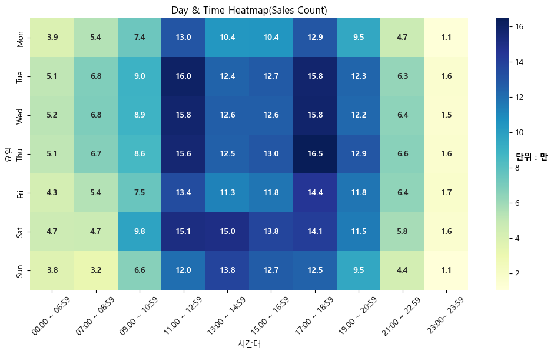    
     - **11-13시 / 17-19시** 구간에서 소비 성향이 가장 강하며, 그 사이 시간대는 상대적으로 감소한다.  
     - 특히 **목요일 저녁(17시)**에 소비량이 가장 크게 나타난다.  
     - 예상과 달리 주말보다 **화·수·목 요일의 매출 건수**가 더 높게 나타난다.

    → 이러한 패턴을 기반으로 **‘점심 특선’**, **‘주중 타임세일’** 등 시간대·요일 기반 마케팅 전략을 고려할 수 있다.

     - 가설
     - “목요일 회식 / 금요일은 개인 휴식” 같은 패턴이 존재할 것이다.
         - 근거
             - 목요일의 경우, 17시 이후에도 높은 건수가 유지된다.
        
         - 가설을 증명하기 위해서 **'음식'** 컬럼의 **요일별 매출금액·매출건수 비교 분석** 필요

     - 심화분석
         - 안정적 직장 또는 사회적 지위를 가진 연령층의 소비가 강하게 확인됨.
             -**4050 세대와 2030 세대가 각각 어떤 업종에 많이 소비하는가?**
             - 예측: 2030은 가성비, 데이트, 혹은 값비싼 음식에 ‘플렉스’하는 경향이 있을 수 있음 

         - **결제 주도권은 남성과 여성 중 어느 쪽이 더 강한가?**  
             - 이 부분은 후속 프로젝트로 진행 예정.

         - 주말보다 화·수·목에 매출 건수가 높은 이유를 파악하기 위해 **다른 월을 포함한 전체 일 별 매출금액과 건수확인**이 필요.
             - 원래 패턴이 화,수,목에 더 집중되는 것인지 파악
             - 7월이 이상데이터일 가능성 확인


### TIL (간단한 Keyword 정리)
 - Heatmap(data, cmap, annot, annot_kws, fmt, cbar, cbar_kws )
     - Heatmap을 사용하기 위해서는 Pivot_Table로 먼저 가공해야한다는 점.
     - '*_kws'를 통한 폰트 설정, label 설정

 - Pivot_Table(index, column, values, aggfunc)
 - .reset_index() / sns.그래프형태 ->(hue='원하는 구분', palette='')
 - plt.axvline(x, color, labels, linewidth, linestyle) 수직선.

 - 한글폰트 설치법(마이너스 부호 깨짐 방지)

## 트러블슈팅 (Troubleshooting)

### 1. 불편한 시각화
- **문제 :** Heatmap맵 데이터 구조 불일치 (Heatmap은 2차원 구조이기 때문)
- **방법 :** Pivot_Table 학습
- **결과 :** 연령대별 시간대 소비 집중 구간을 직관적으로 도출

### 2. 한글 폰트 깨짐  
- **문제 :** 시각화 과정에서 한글 및 기호가 깨지는 현상 발생  
- **원인 :** Matplotlib은 기본적으로 영문 폰트를 사용하며, 한글 폰트 경로를 캐싱하지 못해 깨짐 발생
- **방법 :** 폰트 매니저를 통해 경로를 직접 지정하거나 rcParams을 수정해야 함.
- **결과 :** 경로를 직접 지정하여 한글 폰트 설치
- **추가 기능** 한글로 된 매핑자료를 만들었고 '시각화'와 '전처리'에 용이해졌음

### 추가 공부
 - [x] .collections[0] *무슨 기능인가요 ?* -> 도형들의 리스트(집합) -> 깊이 있는 제어를 할 때 필요
 - [x] cbar = ax.collections[0].colorbar *왜 이렇게 사용하는건가요?* -> 객체지향적으로 세밀하게 다룰 수 있음
 - [ ] Github Markdown -> 학습 중

# 📅 개발 및 학습 일지 (Development Log)
## 08.Dec.2025 [DAY-1] (Colab 활동)
## ✅ 한 일
 - [x] 데이터 전처리 방법 숙지
 - [x] 함수와 파라미터 학습


### 상황
 - 당시 노트북 성능문제로 Colab에서 데이터 전처리 시작.

## 배운점(TIL)
 - 데이터 불러오기
 - '.csv'파일을 pd.read_excel로 불러오는 바람에 실패했음
     - '.csv'와 '.xlsx' 구분
     - 컴퓨터가 파일경로를 읽는 법 파악.
     - .copy()를 통한 데이터 복사
 
 - 컬럼 가공
     - 책에서 학습한 기능들을 직접 사용해보고자 함
     - df.drop() 사용할 때 axis(축)을 지정해줘야하며 즉시 적용은 inplace=T임. 
     - .map() 함수를 사용해 매핑

 - 메모리 사용량
 - 데이터의 양이 많아 메모리 사용량을 줄이고자 함.
     - .astype()을 통한 컬럼의 category 타입화 
     - 하지만 바뀌지 않았고 df.drop()안에 있는 inplace=T 파라미터를 사용해도 불가능했음
     - df['컬럼'] = df['컬럼'].astype('category')코드를 통해 적용 (49.1+ MB -> 16.9 MB 약 65% 절감)
 
 - Pieplot
 - Pieplot으로 시각화
     - 컬럼의 값들이 많아 비중이 적을 수록 글씨가 겹침.
     - 적은 비중의 값들은 기준값변수를 생성하고 'etc' 컬럼을 만들어 합침
     - 퍼센트 뿐 만 아니라 금액(KRW)을 추가하고 싶었음
         - plt.text를 통해 값이 담긴 리스트 생성 후 적용
         - autopct 값을 None으로 조정하고 리스트 생성에 {value;,} / {value:.1f} 등 표현방법 구현
         - 글씨 크기와 글씨 조정을 위해 labeldistance 파라미터, textprops로 조정
     - seaborn의 color_palette()를 통해 pieplot에 colors 파라미터 사용

 - Pieplot의 범례
     - etc 값들을 범례로 따로 표시하고 싶었음
         - 숙련도 이슈로 실패함
         - 대신 '텍스트 박스'라는 개념을 도입(bbox_to_anchor)
    **하지만**, 가독성의 문제로 많은 양의 데이터를 시각화하기에는 Pieplot보다는 'Horizontal Bar Chart'가 더 좋을 것같음.

## TIL(간단한 Keyword 정리)
 - plt.figure(figsize=(x,y))
 - plt.pie(x, labels, autopct, colors, explode, labeldistance, textprops)
 - df.groupby('')[''] -> ()묶은 그룹의 []원하는 컬럼
 - {value:.1f} or (value:,) 등 표현방법

### 추가 공부
 - [x] plt.legend(bbox_to_anchor) -> *bbox_to_anchor(bbox)* : 배경상자 속성으로, 네모난 경계 영역을 생성함

---
## 프로젝트 목표
1. Python 및 데이터 분석 전반에 익숙해지기  

   - (최종 목표: **실무 2~3년차 수준**을 향한 성장)

2. 데이터 기반 **인사이트 도출 및 패턴 발견**

3. 연령별 **타겟 마케팅 전략** 수립

4. **PPT 발표 수준의 분석 자료 제작**

## 평가기준
 - 동네를 잘 모르는 사람도 전략을 이해할 수 있어야 함.

 - 그래프가 이해하기 쉽고 타당하며 가독성, 심미성, 전문성을 챙겼는가?

 - 신뢰성이 있는 자료인가?

 - 코드의 비효율성이 있었는가 ? 

 - 인사이트를 도출하고 전략을 수립했는가 ? 

 - 사용자의 Python 및 데이터 분석 스킬이 늘었는가 ? 

## 분석 환경 및 도구 (Tech Stack)

- **Language:** Python 3.14 , R 4.5.1

- **Data Handling:** Pandas (데이터 전처리, 피벗테이블)  

- **Visualization:** Matplotlib, Seaborn (히트맵, 서브플롯)  

- **Environment:** VS Code, R Studio Git / GitHub  

- **Module:** `config.py` 기반 전역 설정(폰트, 매핑) 모듈화


