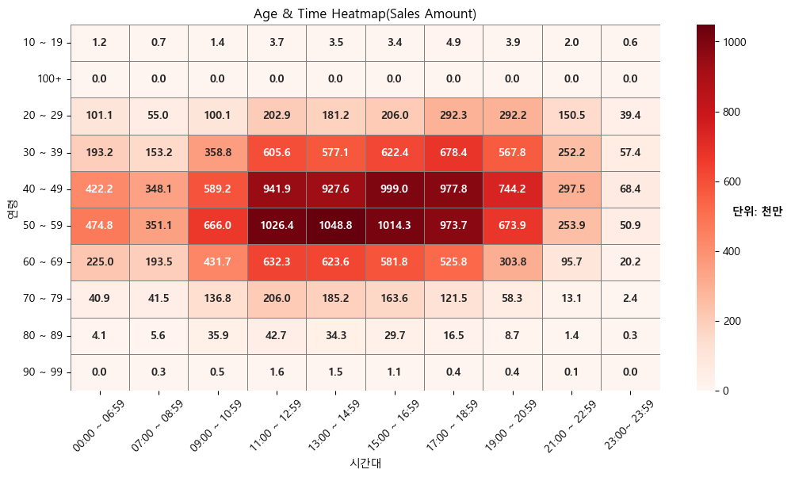

# 이천시 결제 데이터 분석 (공공데이터 기반 / 분석 연습)

## Today's Insight 1  

  

위 그래프는 **연령대와 시간대**를 기준으로 시각화한 히트맵입니다.

- 1) 이천시에서 결제가 가장 활발한 연령층은 **40대와 50대**이며, 경제활동 인구인 20대부터 은퇴 연령층인 70대까지 모두 일정한 소비력을 갖는 **‘결제 연령층’**으로 보인다.  

- 2) **09시~21시** 사이에 소비가 가장 많이 이루어지며, 특히 **점심(11~13시)**과 **저녁(17~19시)** 시간대가 두드러진다.  

  → 즉, 회사 점심시간·퇴근 직후 시간이 핵심 소비 시간대로 해석된다.

---

## Today's Insight 2  

- 1) **11~13시 / 17~19시** 구간에서 소비 성향이 가장 강하며, 그 사이 시간대는 상대적으로 감소한다.  

- 2) 특히 **목요일 저녁(17시)**에 소비량이 가장 크게 나타난다.  

- 3) 예상과 달리 주말보다 **화·수·목 요일의 매출 건수**가 더 높게 나타난다.

→ 이러한 패턴을 기반으로 **‘점심 특선’**, **‘주중 타임세일’** 등 시간대·요일 기반 마케팅 전략을 고려할 수 있다.

---

## 추가 분석 방향

### about Insight 1  

- 안정적 직장 또는 사회적 지위를 가진 연령층의 소비가 강하게 확인된다.  

  → 그렇다면 **4050 세대와 2030 세대가 각각 어떤 업종에 많이 소비하는가?**  

    - (예측: 2030은 가성비, 데이트, 혹은 값비싼 음식에 ‘플렉스’하는 경향이 있을 수 있음)  

  → 또한 **결제 주도권은 남성과 여성 중 어느 쪽이 더 강한가?**  

    - 이 부분은 후속 프로젝트로 진행 예정.

### about Insight 2  

- 주말보다 화·수·목에 매출 건수가 높은 이유를 파악하기 위해 **요일별 매출금액·매출건수 비교 분석**이 필요.  

- 특히 목요일의 경우, 17시 이후에도 높은 건수가 유지된다.  

  → “목요일 회식 / 금요일은 개인 휴식” 같은 패턴이 존재하는지 가설을 세울 수 있음.

---

## 2. 분석 환경 및 도구 (Tech Stack)

- **Language:** Python 3.14  

- **Data Handling:** Pandas (데이터 전처리, 피벗테이블)  

- **Visualization:** Matplotlib, Seaborn (히트맵, 서브플롯)  

- **Environment:** VS Code, Git / GitHub  

- **Module:** `config.py` 기반 전역 설정(폰트, 매핑) 모듈화

---

## 프로젝트 목표  

저는 Github와 같은 협업 도구나 실무 경험이 아직 부족한 초보자입니다.  

이 프로젝트의 목표는 다음과 같습니다.

1. Python 및 데이터 분석 전반에 익숙해지기  

   - (최종 목표: 실무 2~3년차 수준을 향한 성장 ★★★★★)  

2. 데이터 기반 인사이트 도출 및 패턴 발견  

3. 연령별 타겟 마케팅 전략 수립 (★★★)  

4. 지역을 잘 모르는 사람도 쉽게 이해할 수 있는 분석 자료 제작 (★★★)

---

## 프로젝트 배경

- 학교 매점이 늦게 생겼지만 매출이 폭발했고 지금도 꾸준히 좋으며, 수원(화서)에 스타필드가 새로 생겼습니다.   

- 동네(이천시)와 인근 지역(탑동)은 사람 수는 적어도 소비력이 높아 ‘돼지동네’라고 불릴 정도  

  - 예: 집 앞 버거킹이 전국 매출 4위  

- 왜 기업은 수원을 선택했고, 매출이 잘 되는지가 궁금하며 또, **기업의 입장에서, 직접 가보지 않아도 이런 ‘잘 되는 동네’를 데이터로 찾아낼 수 있다면 얼마나 좋을까?** 라는 생각이 들었습니다.

→ 이런 호기심이 프로젝트를 시작한 배경이 되었습니다.

---

## 4. 트러블슈팅 (Troubleshooting)

### 1) `pivot_table` 집계 오류  

- **문제:** `cnt` 컬럼이 원하는 방식으로 집계되지 않음  

- **원인:** `aggfunc` 기본값이 `mean`(평균)으로 설정되어 있었음  

- **해결:** `aggfunc='sum'` 설정을 명시하여 총 건수를 정확하게 집계

### 2) 한글 폰트 깨짐  

- **문제:** 시각화 과정에서 한글이 깨지는 현상 발생  

- **해결:** `config.py`에 폰트 설정을 함수화하여 실행 시 자동 적용되도록 구조 개선

**ta_ymd :** 기준 년월일(YYYYMMDD) / **cty_rgn_no :** 시·군·구 코드

**dmi_cty_no :** 행정동 코드(행정안전부 기준) / **card_tpbuz_cd :** 카드사 업종 분류 코드

**card_tpbuz_nm_1 :** 업종 대분류명 / **card_tpbuz_nm_2 :** 업종 중분류명

**sex : **성별(M/F) / **age :** 연령대 코드(01: 0–9세, 02: 10–19세, …, 11: 100세 이상)

**hour :** 시간대 코드(01: 00–06시, 02: 07–08시, 03: 09–10시, …, 10: 23시)

**day :** 요일 코드(01: 월, 02: 화, 03: 수, 04: 목, 05: 금, 06: 토, 07: 일)

**amt :** 매출 금액

**cnt :** 매출 건수

